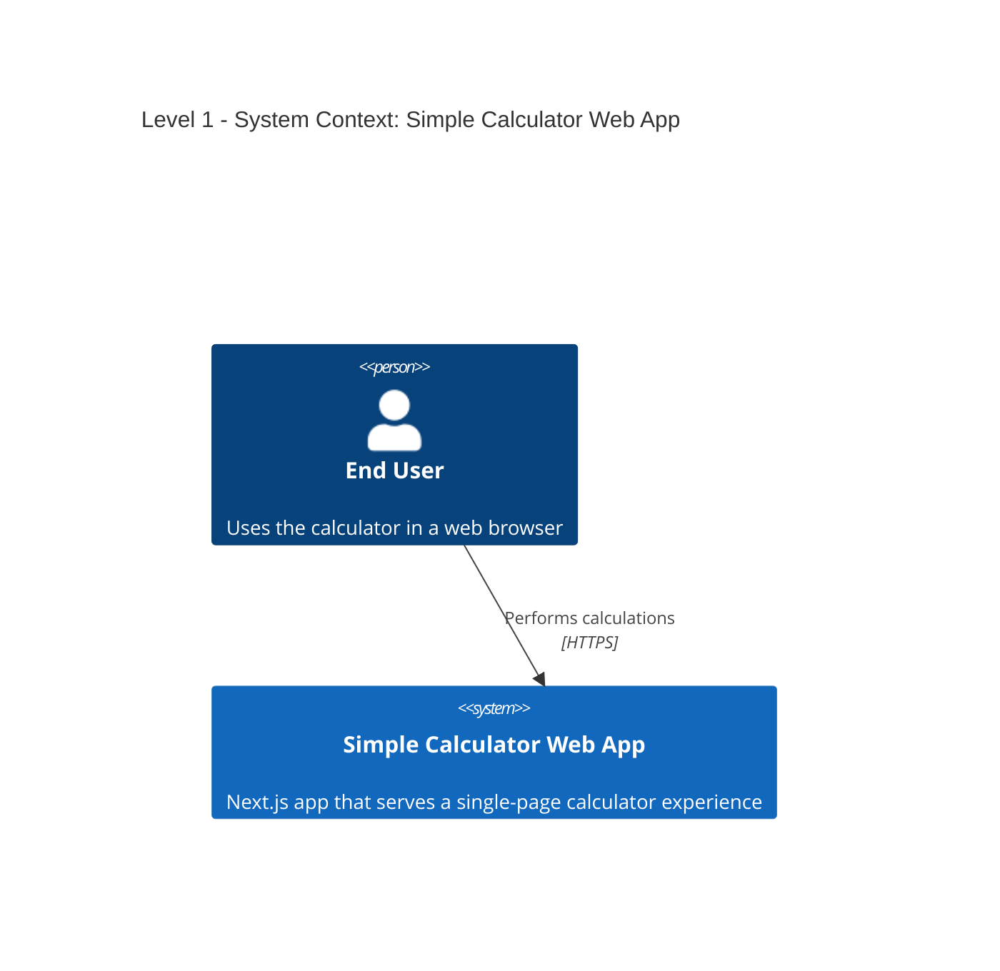
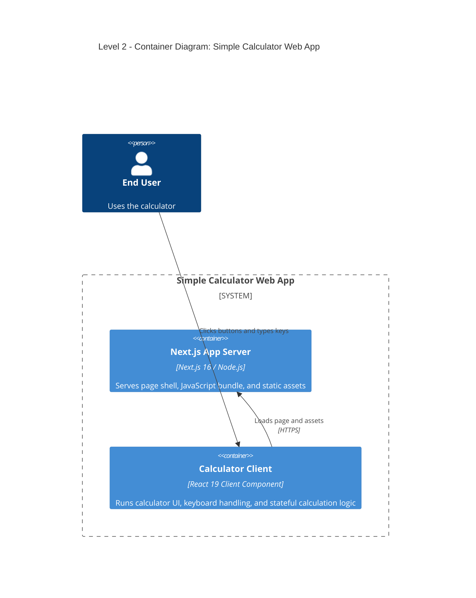
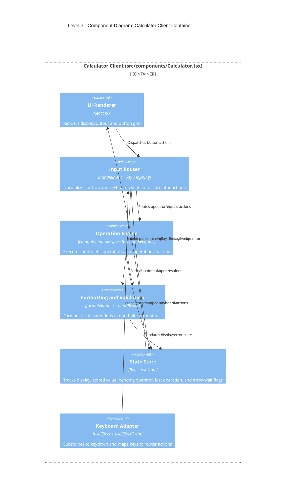
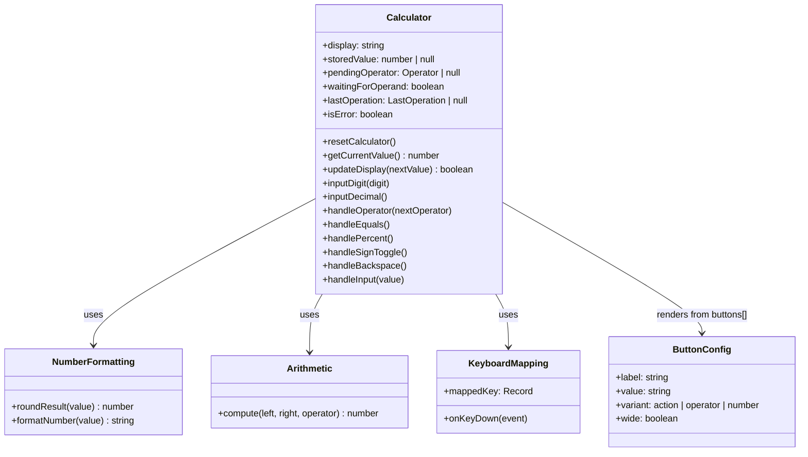

# C4 Architecture Diagrams

This document captures the architecture of the current calculator application using C4 model levels.

## Level 1: System Context

## Level 2: Container Diagram

## Level 3: Component Diagram

## Level 4: Code Diagram

## Source Mapping

- Root layout and metadata: src/app/layout.tsx
- Page shell: src/app/page.tsx
- Calculator implementation: src/components/Calculator.tsx
- Global styling/theme: src/app/globals.css
